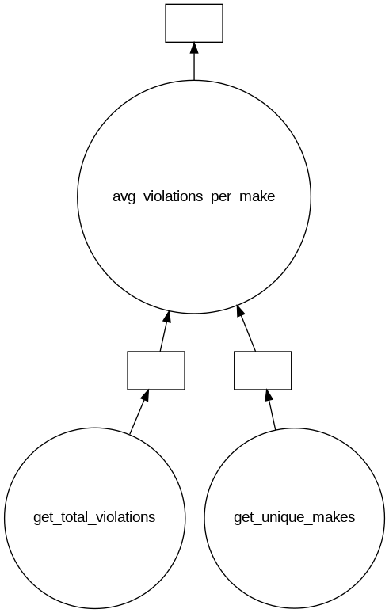
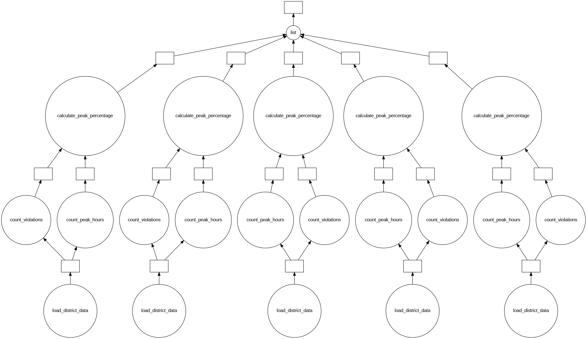

# Лабораторная работа №4. Анализ и обработка больших данных с Dask (ETL-пайплайн)

**Вариант 14**: `Parking_Violations_Issued_-_Fiscal_Year_2015.csv` (2.8 ГБ)

**Цель работы:** изучить инструменты Dask для обработки Big Data, освоить построение ETL-пайплайнов с «ленивыми вычислениями» и визуализировать графы выполнения задач (DAG).

## Шаг 1. Extract (Извлечение данных)

Для работы с файлом объемом 2.8 ГБ (около 11 млн строк) используется `dask.dataframe`. Настраиваем локальный кластер для параллельной обработки.

```python
import dask.dataframe as dd
from dask.distributed import Client
from dask.diagnostics import ProgressBar

# Инициализация клиента Dask (2 воркера, 2 потока на воркер)
client = Client(n_workers=2, threads_per_worker=2, processes=True)

# Чтение данных с указанием типов для оптимизации
dtypes = {
    'Issuer Command': 'object', 'Issuer Squad': 'object',
    'House Number': 'object', 'Time First Observed': 'object',
    'Violation Description': 'object', 'Violation Legal Code': 'object',
    'Violation Post Code': 'object', 'Unregistered Vehicle?': 'float64',
    'Violation Location': 'float64', 'Date First Observed': 'object',
    'Feet From Curb': 'float64', 'Law Section': 'object',
    'Vehicle Year': 'float64', 'Meter Number': 'object',
    'Violation County': 'object',
    'Double Parking Violation': 'object',
    'Hydrant Violation': 'object',
    'No Standing or Stopping Violation': 'object'
}

df = dd.read_csv('Parking_Violations_Issued_-_Fiscal_Year_2015.csv', dtype=dtypes, low_memory=False)
```
Результат:


## Шаг 2. Transform (Трансформация и очистка данных)

Проведено профилирование качества данных (подсчет пропусков). Столбцы с пропуском более 55% удаляются. Также удаляются технические столбцы, не несущие смысловой нагрузки для анализа.

```python
#from dask.diagnostics import ProgressBar

# Подсчет пропущенных значений (построение графа вычислений)
missing_values = df.isnull().sum()

# Вычисление процента пропусков
mysize = df.index.size
missing_count = ((missing_values / mysize) * 100)

# Запуск реальных вычислений только для агрегированной статистики
with ProgressBar():
    missing_count_percent = missing_count.compute()

print(missing_count_percent.sort_values(ascending=False).head(15))

# Формирование списка столбцов, где пропусков > 55%
columns_to_drop = list(missing_count_percent[missing_count_percent > 55].index)
print("\nУдаляемые столбцы (пропуски > 55%):", columns_to_drop)

# Ленивое удаление столбцов
df_dropped = df.drop(columns=columns_to_drop)

# Удаление дополнительных технических и избыточных столбцов
additional_columns = [
    'Street Code1', 'Street Code2', 'Street Code3',
    'Issuer Code', 'Feet From Curb', 'Violation Post Code'
]

existing_extra = [c for c in additional_columns if c in df_dropped.columns]
df_final = df_dropped.drop(columns=existing_extra)

# Преобразование формата даты
df_final['Issue Date'] = dd.to_datetime(df_final['Issue Date'], errors='coerce')

df_final.head()
```

**Результат очистки:**
Удалены столбцы с максимальным количеством пропусков: `NTA`, `BBL`, `BIN`, `Latitude`, `Longitude` и др.


## Шаг 3. Load (Загрузка / Сохранение результатов)

Очищенный датасет сохраняется в формате Parquet, который является стандартом де-факто для больших данных благодаря колоночному хранению и высокой скорости чтения/записи в Dask.

```python
df_final.to_parquet('cleaned_violations_2015.parquet', engine='pyarrow')
```
Результат:


## Визуализация DAG

### 1. Простой граф (Аналитика марок ТС)

Граф визуализирует процесс подсчета общего числа строк, уникальных марок автомобилей и вычисление среднего значения нарушений на марку.

```python
from dask import delayed
from IPython.display import Image

def get_total_violations():
    return len(df_final)

def get_unique_makes():
    return df_final['Vehicle Make'].nunique().compute()

def avg_violations_per_make(total, unique):
    if unique == 0: return 0
    return round(total / unique, 2)

x = delayed(get_total_violations)()
y = delayed(get_unique_makes)()
z = delayed(avg_violations_per_make)(x, y)

try:
    z.visualize(filename='simple_violation_analysis.png')
    display(Image('simple_violation_analysis.png'))
except:
    print("Graphviz not found.")

print("Результат вычисления DAG:", z.compute())
```
Результат: 



### 2. Сложный граф (Анализ по районам NYC)

Построение многоуровневого графа для анализа доли нарушений в часы пик (8:00 - 10:00) в разрезе округов (Violation County).

```python
districts = ['NY', 'K', 'Q', 'BX', 'R']

layer1 = [delayed(load_district_data)(d, df_final) for d in districts] # Фильтрация
layer2 = [delayed(count_violations)(d) for d in layer1]                # Всего в районе
layer3 = [delayed(count_peak_hours)(d) for d in layer1]               # В часы пик
layer4 = [delayed(calculate_p)(t, p) for t, p in zip(layer2, layer3)]   # Процент %

final_results = delayed(list)(layer4)
final_results.visualize(filename='complex_graph.png')
```
Результат:



## Аналитика
